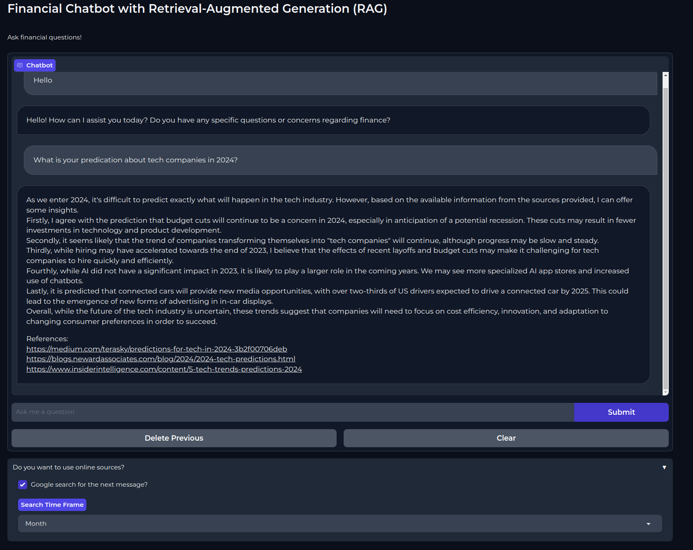

# PerCent - Your Personal Finance Partner 💰

Welcome to **PerCent**! Designed to guide you toward financial success, PerCent provides personalized insights, interactive features, and accessible finance education. Whether you’re budgeting for the first time or looking to optimize your financial strategy, PerCent is here to support your journey to financial independence.

---

## 🌟 Inspiration
PerCent was inspired by the common struggle many young adults face—especially international students and new professionals—when managing their finances for the first time. Transitioning from relying on family support to handling budgets independently can be daunting. We created PerCent to make this journey smoother for everyone, regardless of their financial experience.

---

## 🚀 Key Features
**PerCent** empowers users with essential tools to manage and improve their financial well-being:
- **Goal Tracking**: Define and monitor both monthly and long-term savings goals with real-time progress updates.
- **Chatbot Assistance**: Receive personalized financial advice through an interactive, AI-powered chatbot. Get answers to general finance questions or tailored tips based on your spending habits.
- **Educational Resources**: Stay informed with financial courses and the latest personal finance news, helping you make educated financial decisions.

Whether you’re saving for a big purchase, managing your monthly budget, or expanding your financial knowledge, PerCent is your dedicated financial partner.

---

## RAG-BOT: Your Financial Chatbot with Retrieval-Augmented Generation (RAG)

Alongside PerCent, we developed **RAG-BOT**, a Python-based financial chatbot powered by Retrieval-Augmented Generation (RAG). RAG-BOT combines real-time insights from online sources with user input, delivering accurate, relevant answers to financial questions in a conversational format.

### RAG-BOT Overview


RAG-BOT’s structured workflow ensures efficient and accurate responses:
1. **User Query**: Receives and processes user financial questions.
2. **Summarization**: Summarizes lengthy queries for streamlined searches.
3. **Google Search**: Fetches the top 3 results within a set timeframe.
4. **Web Scraping**: Uses Selenium for content extraction (requires Chrome).
5. **Text Refinement**: Filters content for quality, removing irrelevant text.
6. **Semantic Search**: Uses the ‘all-mpnet-base-v2’ model to match user queries with top information from web sources.
7. **Summarization**: Summarizes relevant paragraphs to refine the response.
8. **Prompt Engineering**: Combines the query with summarized data for optimized response generation.
9. **Qwen Model**: Generates responses with the *"Qwen/Qwen-14B-Chat-Int4"* model.
10. **Response & References**: Provides users with an answer and sourced references.

### RAG-BOT Usage Instructions

To use RAG-BOT:
1. **Clone the Repository**:
    ```bash
    git clone https://github.com/adityapai18/HackNC24.git
    cd RAG-bot
    ```
2. **Set Up Environment**:
    ```bash
    conda create -n fschat python=3.8
    conda activate fschat
    pip install -r requirements.txt
    ```
3. **Run the Application**:
    ```bash
    python main.py
    ```

Once launched, click the link in the terminal to open the Gradio ChatInterface, where you can ask financial questions and get responses based on the latest online data.

---

## 🛠️ Tech Stack & Development Process
PerCent leverages a robust tech stack to deliver a seamless and efficient user experience:
- **Frontend**: Built with React Native and React for smooth, user-friendly interfaces.
- **Backend**: Powered by Express and Redis to handle server-side processing and manage data efficiently.
- **Database**: PostgreSQL ensures reliable data storage and quick retrieval.
- **AI & NLP**: Integrated with Hugging Face models to enhance our chatbot’s responsiveness and personalization.

With a two-member team, we streamlined our workflow to cover both frontend and backend, ensuring cohesive feature implementation.

---

## 💪 Challenges
Developing PerCent came with its share of obstacles:
- **Hardware Limitations**: One team member’s laptop stopped working midway, leading us to share a single device, which tested our collaboration skills.
- **Compatibility Issues**: Midway through development, updates in Expo and React Native introduced routing changes, prompting us to adapt quickly to ensure app stability.

---

## 🏆 Accomplishments
Despite the challenges, we’re proud to have built a fully functional and impactful app that includes nearly all our intended features. Our journey required perseverance, adaptability, and teamwork, all of which were crucial in overcoming the technical and time-related hurdles.

---

## 📚 Lessons Learned
This experience underscored the importance of resilience, adaptability, and efficient time management in high-stakes settings. Beyond the technical growth, we gained insights into hackathon culture, networking, and effective teamwork.

---

## 🔮 Future Plans for PerCent
We’re excited about PerCent’s potential! Upcoming features include **Family Integration**, allowing users to set and work towards shared financial goals with family members. This will make financial planning more inclusive and goal-oriented, enhancing collaboration for households.

---

## 👥 Team
- **Frontend & UX**: Aditya Kulkarni
- **Backend & Database**: Aditya Pai

---

Thank you for exploring **PerCent**! We look forward to helping people everywhere achieve financial confidence and independence. 😊